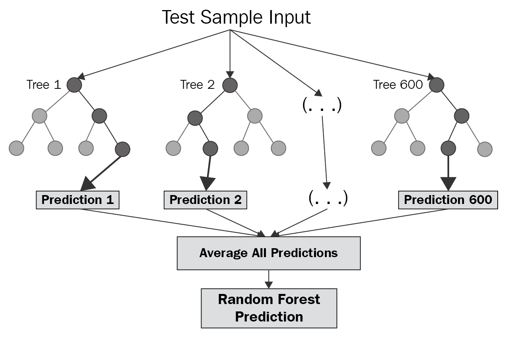

```{r,echo=FALSE, results="hide", include=FALSE}
#libraries

library(stringr)
library(corrplot)
library(MASS)
library(glmnet)
library(forecastSNSTS)
library(randomForest)
library(png)
library(grid)
library(gridExtra)

```

```{r, echo=FALSE, results="hide"}

house.data = read.csv("finalData.csv")

#remove certain veriables
house.data$X = NULL
house.data$state = NULL
house.data$taxAssessmentYear = NULL
house.data$street = NULL


#change data types
house.data$latitude = suppressWarnings(as.numeric(as.character(house.data$latitude)))
house.data$longitude = suppressWarnings(as.numeric(as.character(house.data$longitude)))
house.data$taxAssessment = suppressWarnings(as.numeric(as.character(house.data$taxAssessment)))
house.data$yearBuilt = suppressWarnings(as.numeric(as.character(house.data$yearBuilt)))
house.data$lotSizeSqFt = suppressWarnings(as.numeric(as.character(house.data$lotSizeSqFt)))
house.data$finishedSqFt = suppressWarnings(as.numeric((as.character(house.data$finishedSqFt))))
house.data$bathrooms = suppressWarnings(as.numeric(as.character(house.data$bathrooms)))
house.data$estimateValue = suppressWarnings(as.numeric(house.data$estimateValue))
house.data$totalRooms = suppressWarnings(as.numeric(as.character(house.data$totalRooms)))
house.data$lastSoldDate = suppressWarnings(as.Date(as.character(house.data$lastSoldDate), format = "%m/%d/%Y"))
house.data$yrsSinceLastSold = round(as.numeric(as.Date("19-12-6") - house.data$lastSoldDate)/365.25)
house.data$yrsSinceLastSold[!is.na(house.data$yrsSinceLastSold) & house.data$yrsSinceLastSold < 0] = house.data$yrsSinceLastSold[!is.na(house.data$yrsSinceLastSold) & house.data$yrsSinceLastSold < 0] + 99
house.data$yrsSinceLastSold[is.na(house.data$yrsSinceLastSold)] = 0

house.data$taxAssessment[is.na(house.data$taxAssessment)] = 0

#house.data$lastSoldPrice[house.data$lastSoldPrice == FALSE] = 0
house.data$lastSoldPrice = as.character(house.data$lastSoldPrice)
usdLines = grep("USD", as.character(house.data$lastSoldPrice))

hold = as.character(house.data$lastSoldPrice[usdLines])
hold2 = nchar(hold)

house.data$lastSoldPrice[usdLines] = substr(hold,start = 5, stop = nchar(hold))
house.data$lastSoldPrice = suppressWarnings(as.numeric(house.data$lastSoldPrice))
house.data$lastSoldPrice[is.na(house.data$lastSoldPrice)] = 0

house.data$latFromBos = abs(house.data$latitude - 42.3601)
house.data$longFromBos = abs(house.data$longitude + 71.0589)
house.data$L2FromBos = sqrt(house.data$latFromBos^2 + house.data$longFromBos)

house.data = house.data[house.data$estimateValue != 0,]

#remove all cooperative duplex and townhouse (not enough data)
house.data = house.data[house.data$useCode != "Cooperative"&house.data$useCode != "Townhouse"&house.data$useCode != "Duplex",]
#one row does not have bathroom data and upon review should be removed
house.data = house.data[!is.na(house.data$bathrooms),]


house.data$yearBuilt[is.na(house.data$yearBuilt)] = 2019
house.data$lotSizeSqFt[is.na(house.data$lotSizeSqFt)] = 0
house.data$finishedSqFt[is.na(house.data$finishedSqFt)] = 0

house.data$lastSoldDate = NULL

#house.data = house.data[!is.na(house.data$totalRooms),] #round(mean(house.data$totalRooms, na.rm = T),1)

house.data = house.data[house.data$estimateValue<2e6,]

# change character to factor
for (col.name in colnames(house.data)){
  if (is.character(house.data[,col.name])){
    house.data[,col.name] = as.factor(house.data[,col.name])
  }
}

#97 NA's exist for total rooms here we fill in number of rooms 
set.seed(100)
house.data = rfImpute(estimateValue ~., data = house.data, iter = 10)

```

```{r, echo=FALSE, results="hide"}

#create training and validation data sets


sample <- sample.int(n = nrow(house.data), size = floor(.8*nrow(house.data)), replace = F)

train = house.data[sample,]

validate = house.data[-sample,]

train$lastSoldDate = NULL
validate$lastSoldDate = NULL

train$zipcode = NULL
validate$zipcode = NULL

```

```{r, echo=FALSE, results="hide"}

#create everything for a correlation plot

train.numeric = train[,c(3,4,6,7,8,9,10,11,12,13,14,15,16)]

train.numeric[is.na(train.numeric)] = 0

train.cor = cor(x = as.matrix(train.numeric))

#corrplot(train.cor)

```

```{r, echo=FALSE, results="hide"}

#linear models

train.lm1 = lm(estimateValue ~ . , data = train)

#boxcox will be shown below - cannot compute without plotting

#tried models with boxcox and log(y)

lm.start = lm(estimateValue^0.2 ~ 1 , data = train)

train.lm2 = step(lm.start, direction = "both", scope = formula(train.lm1))

lm.start = lm(log(estimateValue) ~ 1, data = train)

train.lm3 = step(lm.start, direction = "both", scope = formula(train.lm1))

train.lm4 = lm(estimateValue~ .^2, data = train)

#summary(train.lm4)

#will not run lm5

# lm.start = lm(estimateValue^0.3 ~ 1 , data = train)
# 
# train.lm5 = lm(step(lm.start, direction = "both", scope = formula(train.lm4)))

# summary(train.lm5)
# 
# plot(train.lm5)


```

```{r, echo=FALSE}
#random forest
##random forest model 1
rfm1 = randomForest(estimateValue~., data = train, ntree = 1000, mtry = 10)

rfp1 = predict(rfm1, newdata = validate)

##model 2
rfm2 = randomForest(estimateValue^0.2~., data = train, ntree = 1000, mtry = 10)

rfp2 = predict(rfm2, newdata = validate)

##model 3

rfm3 = randomForest(log(estimateValue)~., data = train, ntree = 1000 , mtry = 10)

rfp3 = predict(rfm3, newdata = validate)

```

```{r, echo=FALSE}

#new linear model

train.lm6 = lm(estimateValue^0.2~bathrooms+ L2FromBos + taxAssessment+ finishedSqFt + bathrooms + totalRooms:L2FromBos + lastSoldPrice  + longFromBos + L2FromBos + useCode, data = train)

```

```{r, echo=FALSE}


```


## Background
```{r backgroundTalk, echo=FALSE}
#We wanted to look into what factors affect housing prices. We chose to use Zillow to extract our data, as it has over 110 million homes in its database along with substantial metrics accompanying these homes. Examples of conventionally influential meterics are the number of number of bathrooms, square footage, year built, and total number of rooms. Zillow also provides other metrics, which are not typically thought of to influence housing prices. We wanted to look for correlations between these unconventional metrics and housing prices in addition to the potential existance of causal effect(s).</font>
```
<div class="jumbotron">
  <h2> Why? </h2>
  <ul style="margin-bottom: 10%">
    <li class="lead">110 million homes</li>
    <li class="lead">Organized data</li>
    <li class="lead">Correlation vs Causality</li>
  </ul>
</div>

## Data Collection
<div class="jumbotron">
  <div style="margin-bottom: 5%">
  ```{r dataCollectionVisual-failure, echo=FALSE}
  fluidRow(
    column(4, img(style="background-color: red; margin-top: 5%", src='./images/failScrape.png')),
    column(8, img(src='./images/captcha.png'))
  )
  ```
  </div>
  <div style="margin-bottom: 5%">
  ```{r dataCollectionVisual-success, echo=FALSE}
  fluidRow(
    column(6, img(src='./images/postman.png')),
    column(6, img(style="background-color: green; margin-top: 5%", src='./images/successScrape.png'))
  )
  ```


## About the Data

<div class="jumbotron">
sample size: 525

SCRAPED VARIABLES:  
Estimated value (predicted, numeric)  
Street (factor, not used)  
Zip Code (factor, not used)  
City (factor, used)  
State (factor, not used)  
Latitude (numeric, used)  
Longitude (numeric, used)  
Use Code (factor, used)  
Tax Assessment Year (numeric, not used)  
Tax Assessment (numeric, used)  
Year Built (numeric, used)  
Lot Size (Sq ft) (numeric, used)  
Finished Size (Sq ft) (numeric, used)  
Bathrooms (numeric, used)  
Total Rooms (numeric, used)  
Last Sold Date (date, not used)  
Last Sold Price (numeric, used)  
  
CREATED VARIABLES:  
Years Since Sold (numeric)  
Latitude From Boston (numeric)  
Longitude From Boston (numeric)  
Distance From Boston (numeric, Euclidean)

CLEANING:  
variables were created and discarded  
variables were changed to their correct type  
Lot Size was set to 0 for Condos  
cities with small sample sizes were removed  
40 estimated values of 0 were remoed from the data  
97 NA's remained in Total Rooms  
values were imputed using random forests (rfImpute())
  
403 observations remained  

```{r,echo=F}

summary(house.data)

```

</div>


## Regression Analysis
#### Initial Linear Model
<div class="jumbotron">
80% (322) observations were used as the training data  
  
First, a linear model with all variables was created


```{r, ehco = F}

summary(train.lm1)

```

 ```{r, fig.show='hold', results="hide"}

img1 <-  rasterGrob(as.raster(readPNG("./images/lm1 resid.png")), interpolate = FALSE)
img2 <-  rasterGrob(as.raster(readPNG("./images/lm1 qq.png")), interpolate = FALSE)
grid.arrange(img1, img2, ncol = 2)

  ```

</div>

## Box Cox transformation
<div class="jumbotron">


 ``` {r, out.width='75%', fig.align='center', fig.cap='', echo=F}
        
``` 


```{r, echo=F}


#for some reason i get an error when i try calculate the box cox
# bc = boxcox(train.lm1)
# 
# optLambda = bc$x[which(bc$y == max(bc$y))]

cat("the optimal lambda was calculated at", 0.22)

```


</div>

<div class="jumbotron">
This allowed us to create 2 transformations of the estimated value

```{r,fig.show='hold',out.width='50%', echo=F}
boxplot(train$estimateValue, main = "origional estimated values")

hist(train$estimateValue, main = "histogram of estimatedValue", xlab = "estimatedValue")

hist(train$estimateValue^0.2, main = "histogram of (estimatedValue)^0.2", xlab = "estimatedValue")

hist(log(train$estimateValue), main = "histogram of log(estimatedValue)", xlab = "estimatedValue")

```
</div>

## Other linear models
<div class="jumbotron">

Models were then produced looking at (estimated value)^0.2 and log(estimated value) using a forward stepwise that compaired the AIC

```{r, echo=F}
cat("summary of model with (estimated value)^0.2")
summary(train.lm2)
```

 ``` {r, out.width='75%', fig.align='center', fig.cap='', echo=F}
        knitr::include_graphics('./images/lm2 qq plot.png')
``` 


```{r, echo=F}
cat("summary of model with log(estimated value)")
summary(train.lm3)
```

 ``` {r, out.width='75%', fig.align='center', fig.cap='', echo=F}
        
``` 

```{r, echo=F}
cat("summary of model with significant terms")
summary(train.lm6)
```

 ``` {r, out.width='75%', fig.align='center', fig.cap='', echo=F}
        
``` 

</div>

## Regularisation
<div class="jumbotron">
L~1~ Lasso:
$$
minimize: J = \sum_{i=1}^{n} (y_i - \hat{y}_i)^2 + \lambda \sum_{j=1}^{p-1} |b_j| \\ = \sum_{i=1}^{n} (y_i - \beta_0+\beta_1x_1+\beta_2x_2+...+\beta_{p-1}x_{p-1})^2 + \lambda \sum_{j=1}^{p-1} |b_j|
$$
L~2~ Ridge:
$$
minimize: J = \sum_{i=1}^{n} (y_i - \hat{y}_i)^2 + \lambda \sum_{j=1}^{p-1} b_j^2 \\ = \sum_{i=1}^{n} (y_i - \beta_0+\beta_1x_1+\beta_2x_2+...+\beta_{p-1}x_{p-1})^2 + \lambda \sum_{j=1}^{p-1} b_j^2
$$


 ``` {r, out.width='75%', fig.align='center', fig.cap='', echo=F}
        knitr::include_graphics('./images/overfitting_21.png')
``` 

The function in R does not allow category variables so this was not used.

</div>


## Random Forest
<div class="jumbotron">

``` {r, out.width='75%', fig.align='center', fig.cap='', echo=F}
        
``` 


 ``` {r, out.width='75%', fig.align='center', fig.cap='', echo=F}
        
``` 

```{r, echo=F}

rfm1

rfm2

rfm3


```


```{r,fig.show='hold',out.width='75%', echo=F}

plot(train$estimateValue, train$estimateValue - rfm1$predicted, main = "Residual when estimating estimatedValue", ylab = "Residual", xlab = "estimatedValue")
points(validate$estimateValue, validate$estimateValue - rfp1, col = "red")
legend(250000,8e5, legend = c("train", "validation"), col = c("black", "red"), pch = c(1,1))

plot(train$estimateValue^0.2, train$estimateValue^0.2 - rfm2$predicted, main = "Residual when estimating estimatedValue^0.2", ylab = "Residual", xlab = "estimatedValue^0.2")
points(validate$estimateValue^0.2, validate$estimateValue^0.2 - rfp2, col = "red")
legend(9.5,2, legend = c("train", "validation"), col = c("black", "red"), pch = c(1,1))

plot(log(train$estimateValue), log(train$estimateValue) - rfm3$predicted, main = "Residual when estimating log(estimatedValue)", ylab = "Residual", xlab = "log(estimatedValue)")
points(log(validate$estimateValue), log(validate$estimateValue) - rfp3, col = "red")
legend(11.25,0.5, legend = c("train", "validation"), col = c("black", "red"), pch = c(1,1))

```

```{r, echo=F}

cat("The mse of random forest 1 when modeling estimateValue is",rfm1$mse[500])
cat("The mse of random forest 2 when modeling estimateValue is", mean((train$estimateValue - rfm2$predicted^5)^2))
cat("The mse of random forest 3 when modeling estimateValue is", mean((train$estimateValue - exp(rfm3$predicted))^2))

cat("The ratio of MSPE/MSE when modeling estimateValue is", round(mean((validate$estimateValue - rfp1)^2)/rfm1$mse[500], 2))


cat("The ratio of MSPE/MSE when modeling estimateValue^0.2 is", round(mean((validate$estimateValue^0.2 - rfp2)^2)/rfm2$mse[500],2))


cat("The ratio of MSPE/MSE when modeling log(estimateValue) is", round(mean((log(validate$estimateValue) - rfp3)^2)/rfm3$mse[500], 2))


```


</div>

## Conclusion 
<div class="jumbotron">
The best model to use appears to be the second random forest.  
Linear models apper to be a poor choice in trying to model property value.  
Random forests appear to do well at modeling estimated property value.  
More data would be useful for creating random forests.

</div>


